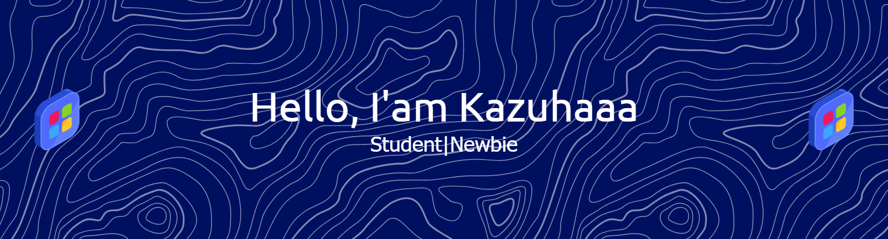

<!--
**kazuhaaa7/kazuhaaa7** is a ✨ _special_ ✨ repository because its `README.md` (this file) appears on your GitHub profile.

Here are some ideas to get you started:

- 🔭 I’m currently working on ...
- 🌱 I’m currently learning ...
- 👯 I’m looking to collaborate on ...
- 🤔 I’m looking for help with ...
- 💬 Ask me about ...
- 📫 How to reach me: ...
- 😄 Pronouns: ...
- ⚡ Fun fact: ...
- 👀 I'm interested in App Dev and Artificial Intelegent

- 👋 Hi, I'm @fathorrossii.i 
- 🌱 I’m currently learning Python Programming Language
- 📬 How to reach me fthrrssi@gmail.com

##### Skills

    

##### Connect Witch Me
 

##### My GitHub Stat

## 🏆 GitHub Trophies

-->

<!-- # Hello World!  -->
# 💫 About Me:
  - 👋 Hi, I'm @fathorrossii.i  - 🌱 I’m currently learning Python Programming Language - 📬 How to reach me fthrrssi@gmail.com

### 🌐 Socials:
    

### 💻 Tech Stack:
               

### 📊 GitHub Stats:
 
 

### 🔝 Top Contributed Repo

---

  ## 💰 You can help me by Donating
   

<picture>
  <source media="(prefers-color-scheme: dark)" srcset="https://raw.githubusercontent.com/maurodesouza/maurodesouza/output/pacman-contribution-graph-dark.svg">
  <source media="(prefers-color-scheme: light)" srcset="https://raw.githubusercontent.com/maurodesouza/maurodesouza/output/pacman-contribution-graph.svg">
  
</picture>
  
<!-- Proudly created with GPRM ( https://gprm.itsvg.in ) -->